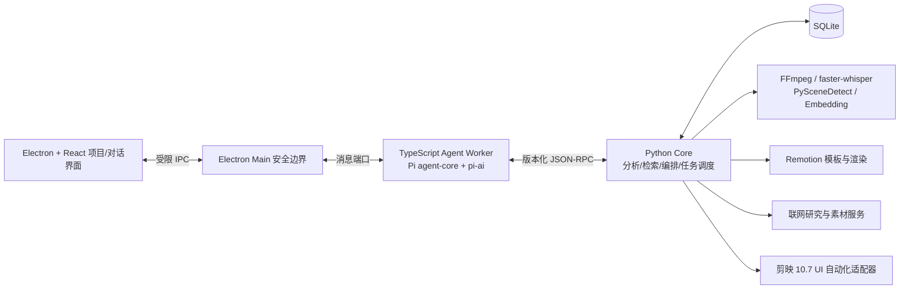
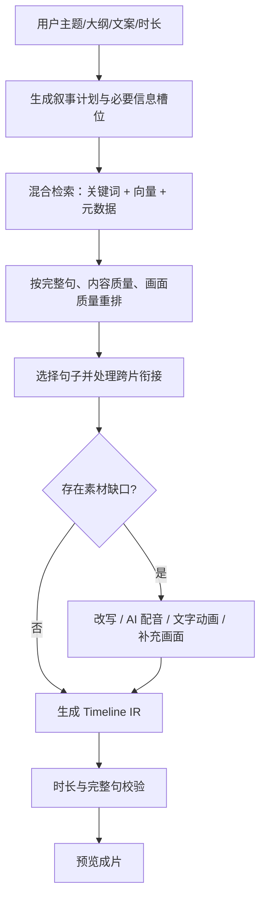

# SuperVideo 第一阶段技术方案

> 状态：需求已确认，关键架构验证已通过，可进入工程实施。
>
> 更新日期：2026-09-15

## 1. 产品目标

SuperVideo 是一个面向个人创作者的本地视频创作智能体。第一阶段优先服务抖音上的“个人 IP 知识口播”，首个业务场景是招聘主题：主播从事人力资源服务，视频主要面向求职者，尤其是工厂、流水线和操作类岗位人群，引导观众在后台联系主播。

产品交互以自然语言为主。用户创建项目，将素材放入项目文件夹，或直接告诉智能体素材所在路径，然后描述想法、文案、目标时长和期望数量。智能体先一键生成可观看的完整初稿，用户再通过自然语言统一修改。最终交付物是：

1. 可直接发布的竖屏 MP4 成片；
2. Windows 剪映专业版 10.7.0 可继续人工调整的剪映草稿。

## 2. 第一阶段范围

### 2.1 支持的创作方式

#### A. 语义混剪

- 从多段不同内容的普通话、单人主讲口播素材中挑选完整句子，重新组织成一个主题视频；
- 可跨文件、跨拍摄批次使用素材；
- 根据用户提供的文案或大纲，在素材中检索语义对应的句子并组装；
- AI 可以改写文案、调整句序、增加过渡；
- 素材缺口可以使用独立 AI 音色、文字画面、程序化动画、图库素材或 AI 生成画面补齐；
- 完整句子不能被截断，这是硬约束；
- 目标时长由用户指定，允许上下浮动 20%。偏差过大时优先更换、增删完整句子，而不是在句中裁切。

#### B. 从想法生成完整视频

- 支持完全没有真人口播素材的作品；
- AI 根据用户想法生成或改写脚本，使用独立 AI 音色配音；
- 画面混合使用文字与程序化动画、用户素材、可商用网络素材、AI 图片，必要时使用 AI 视频；
- AI 视频失败、成本过高或一致性不足时，自动回退到图片运镜或程序化动画；
- 第一阶段不做主播音色克隆，接口预留到后续阶段。

### 2.2 招聘 Excel 批量生成

- 支持固定格式 `.xlsx` 模板；
- 只有当用户在提示词中明确要求“根据这个 Excel 的哪些内容创建什么视频”时，智能体才读取并使用表格；
- Excel 不是每个项目的必填项，也不强制用户先选择岗位；
- 用户可指定生成数量或行范围；
- 第一轮批量生成预览视频，用户选中满意项后再生成正式成片和剪映草稿；
- 行级失败可以单独重试，不影响其他行。

建议模板字段：`job_id`、`岗位名称`、`企业/行业`、`工作地点`、`薪资范围`、`年龄要求`、`学历要求`、`经验要求`、`班次`、`食宿`、`福利`、`工作内容`、`任职要求`、`招聘人数`、`报名方式`、`补充卖点`。字段映射放在配置中，不写死在生成逻辑里。

### 2.3 历史风格学习

- 用户提供本地历史成片文件夹；
- 系统分析主播常用语气、开头钩子、脚本结构、视频时长、字幕样式、画面节奏和视觉风格；
- 生成可查看、可修改的“创作者风格档案”；
- 新视频默认继承该档案，也允许用户在某次任务中覆盖；
- 第一阶段不从抖音主页自动抓取历史视频。

### 2.4 主动联网研究与素材获取

- 智能体可以围绕选题、招聘岗位和受众主动联网研究；
- 可以搜索并下载标记为可商用的图片、视频和音乐；
- 每项网络素材保存来源 URL、作者或平台、下载时间、许可说明和本地文件指纹；
- “可商用”不能只由模型主观判断；没有明确授权信息的素材默认不进入最终成片；
- 用户自行负责第三方账号和服务配置，系统在导出前展示素材来源清单。

### 2.5 明确不做

- 多人访谈、对话剪辑、说话人分离；
- 主播音色克隆；
- 从抖音主页自动获取视频；
- 自动发布到抖音；
- 应用内专业时间线编辑器；
- 读取用户在剪映中手动修改后的草稿并继续编辑；
- 跨设备项目迁移；
- 全版本剪映兼容；第一阶段仅支持当前电脑的 Windows 剪映专业版 10.7.0；
- 对模型调用、生成服务和素材下载做预算上限管理。

## 3. 总体架构决策

采用“Electron 产品壳 + TypeScript Agent Worker + Python 媒体内核 + Remotion/FFmpeg 渲染 + 剪映 UI 自动化”的混合架构。



核心原则：

- Agent 负责理解意图、规划和选择工具，不直接修改数据库、执行任意命令或操作文件系统；
- Python Core 负责所有确定性业务规则、长任务、持久化和副作用；
- 中间视频描述 `Timeline IR` 是唯一事实来源，成片渲染器和剪映导出器都消费同一份 IR；
- 原始素材默认只读引用，任何裁切、转码和生成结果写入项目工作目录；
- 长任务不依赖 Agent 进程存活，应用重启后可从 SQLite 恢复。

## 4. 为什么只使用 Pi 的核心包

采用用户提出的 Pi，但只引入：

- `@earendil-works/pi-ai`：统一模型供应商、流式响应和 OpenAI 兼容服务；
- `@earendil-works/pi-agent-core`：工具循环、事件流、取消和多轮状态。

不引入 Pi 的 coding agent、终端 UI 和通用编码工具。原因是视频产品需要自己的权限边界、项目模型、媒体任务状态和 UI；把通用编码智能体整体嵌入会扩大权限面并增加不必要耦合。

Pi 不是工作流引擎。转写、渲染、下载和剪映操作由自研任务调度器持久化；Agent 只创建任务、查询任务、取消任务、读取结果。这样即使模型请求或 Agent Worker 崩溃，媒体任务仍可恢复。

## 5. 进程与安全边界

### 5.1 Electron Renderer

- React + TypeScript；
- 只负责项目页、对话、任务进度、脚本预览、素材溯源、版本选择和系统设置；
- 开启 `contextIsolation` 和 sandbox；
- 不暴露 Node.js、文件系统或任意 IPC；
- preload 只暴露按业务命名的最小 API。

### 5.2 Electron Main

- 管理窗口、文件选择器、系统托盘和应用生命周期；
- 使用 `utilityProcess.fork()` 启动 Agent Worker；
- 验证所有 Renderer 请求；
- 不承载 LLM 循环和媒体计算，避免阻塞界面。

### 5.3 Agent Worker

- 运行 Pi；
- 维护当前对话上下文和工具事件流；
- 将工具调用转换为白名单 JSON-RPC 请求；
- API Key 不写入对话、Prompt、项目文件或日志；
- Electron utility process 的入口使用薄 CommonJS 启动文件，再动态导入 ESM Agent 模块。此约束来自本项目实际验证。

### 5.4 Python Core

- 建议 Python 3.12，与 `SuperAgent` 已验证环境保持一致；
- 提供本地 RPC 服务、SQLite 仓储、任务调度器、媒体分析和导出适配器；
- RPC 方法逐项注册并用 JSON Schema/Pydantic 校验；
- 禁止 Agent 传入任意可执行命令；FFmpeg 参数由 Core 根据结构化请求生成。

### 5.5 密钥

- 用户自行配置模型、TTS、图片和视频生成服务的 API Key；
- Windows 端使用 Electron `safeStorage`/DPAPI 加密保存密钥；
- 项目数据库只存 `credential_ref`，不存明文；
- 日志统一做 Header、Query 参数、Prompt 中疑似密钥脱敏。

## 6. 项目和存储模型

### 6.1 推荐目录

```text
项目目录/
├─ project.supervideo.json       # 可读项目元数据，不含密钥
├─ data/project.db               # SQLite
├─ cache/                        # 波形、代理文件、缩略图、转写缓存
├─ generated/                    # TTS、AI 图片、动画、网络素材副本
├─ previews/                     # 初稿和版本预览
├─ exports/videos/               # 最终 MP4
├─ exports/jianying/             # 导出过程记录、字幕和素材清单
└─ logs/                         # 脱敏日志
```

外部原始素材只记录绝对路径、文件大小、修改时间和内容指纹，不复制进项目。首次扫描后若文件发生变化或丢失，任务进入 `needs_attention`，不静默替换。

### 6.2 主要数据表

- `projects`：项目配置、目标平台、默认风格；
- `assets`：素材路径、类型、指纹、来源、许可；
- `media_analyses`：技术参数、镜头、转写、质量指标；
- `utterances`：完整句子、字词级时间戳、向量、主题和质量；
- `creator_profiles`：历史风格档案及版本；
- `conversations/messages`：对话与工具事件；
- `plans`：脚本计划和选择理由；
- `timeline_versions`：不可变 Timeline IR 版本；
- `jobs/job_events`：长任务、进度、重试和取消；
- `generations`：模型请求、模型名、参数、结果和费用元数据；
- `exports`：成片和剪映草稿导出结果；
- `source_records`：网络研究和素材许可溯源。

## 7. Timeline IR

Timeline IR 必须比 `SuperAgent` 当前的简单 video/audio/subtitle/image 模型更丰富，但保持渲染器无关。

```ts
interface TimelineProject {
  schemaVersion: 1;
  id: string;
  canvas: { width: 1080; height: 1920; fps: 30 };
  durationMs: number;
  tracks: TimelineTrack[];
  sources: SourceRef[];
  provenance: ProvenanceRef[];
}

interface TimelineClip {
  id: string;
  trackId: string;
  kind: "video" | "audio" | "image" | "text" | "subtitle" | "template";
  sourceId?: string;
  timelineStartMs: number;
  durationMs: number;
  sourceInMs?: number;
  sourceOutMs?: number;
  transform?: Transform;
  volume?: number;
  transitionIn?: Transition;
  transitionOut?: Transition;
  sentenceId?: string;
  editableInJianying: boolean;
  metadata?: Record<string, unknown>;
}
```

每次自然语言修改都从上一版本产生新的不可变 IR，保存修改意图和差异。撤销就是切换活动版本，不覆盖旧版本。

## 8. 素材分析与完整句约束

### 8.1 分析流水线

1. `ffprobe` 获取分辨率、帧率、音轨、时长和编码；
2. 创建低码率代理、缩略图和音频代理；
3. 本地 `faster-whisper` 完成普通话转写和字词级时间戳；
4. 根据标点、停顿、语义完整性和最大时长生成候选句；
5. VAD 修正句首句尾，保留可配置的呼吸边界；
6. 计算清晰度、响度、静音、重复、抖动和画面质量；
7. 生成句级向量和主题标签，写入检索库。

### 8.2 句子边界规则

- 默认裁切点是完整句边界；
- 候选入点向前保留约 80–180ms，出点向后保留约 120–250ms，实际值受 VAD 和相邻语音约束；
- 句尾若只有停顿但语义未完成，不视为完整句；
- ASR 置信度低、句界不确定或音画不同步时标记为 `needs_review`；
- 输出前执行二次 ASR 对齐检查，发现句首/句尾缺字则更换候选或扩大边界；
- 时长优化只能以完整句为最小操作单元。

## 9. 两条生成流水线

### 9.1 语义混剪



检索评分建议由以下信号组成：语义相关度、关键词覆盖、角色/岗位字段一致性、句子独立完整度、口播质量、画面质量、与相邻句衔接度、重复惩罚和来源多样性。权重应可配置并保存到计划版本中。

当用户给出完整文案时，先将文案拆成“信息槽位”，逐槽检索素材，而不是要求原文逐字命中。允许对过渡语和缺失槽位做 AI 改写；关键事实（薪资、地点、年龄等）来自 Excel 或用户提供数据时不可擅自改动。

### 9.2 从想法生成视频

1. 研究主题、受众和事实边界；
2. 生成钩子、主体、行动号召组成的脚本；
3. 按镜头拆分脚本并决定视觉类型；
4. 生成 TTS；
5. 为每段选择用户素材、合规图库、AI 图片、AI 视频或 Remotion 模板；
6. 建立 Timeline IR 并渲染；
7. 自动检查字幕、音量、黑帧、静帧、时长和素材许可；
8. 输出预览，接受自然语言修改。

招聘视频的默认结构可以作为可选模板：痛点/机会钩子 → 岗位与地点 → 薪资福利 → 工作内容与门槛 → 适合人群 → 私信 CTA。它不能覆盖用户明确提示，也不能强制每次使用。

## 10. Remotion、FFmpeg 与 AI 视频的分工

### Remotion

适合确定性的程序化画面：标题卡、岗位信息卡、薪资数字动画、地图和地点、步骤说明、数据图表、字幕强调、图片运镜、品牌片头片尾。优点是可复现、可模板化、文字准确，适合招聘信息表达。

### FFmpeg

负责代理文件、裁切、转码、音频标准化、画面拼接、格式检查和部分高效滤镜处理。简单口播混剪无需全部经过浏览器渲染。

### 真正的 AI 视频

由生成模型产生新的像素和运动，适合真实感 B-roll 或难以拍摄的场景，但可控性、一致性、成本和等待时间更差。第一阶段把它作为某些镜头的可选素材来源，而不是整条视频的基础渲染器。

### 推荐策略

- 信息表达、字幕、品牌组件优先 Remotion；
- 真人口播裁切和基础媒体处理优先 FFmpeg；
- 氛围和场景补充优先合规图库或 AI 图片运镜；
- 只有视觉收益明显时才调用 AI 视频；
- Remotion 模板以版本号固定，构建后 bundle 复用；商用前单独核对其当前许可证条件。

## 11. 成片和剪映草稿

### 11.1 成片

- 由 Timeline IR 经 FFmpeg/Remotion 组合渲染；
- 默认 1080×1920、30fps、H.264 + AAC，参数可在导出预设中调整；
- 预览使用较低码率，用户确认后生成正式成片；
- 输出附带 `manifest.json`，记录 IR 版本、素材指纹、模型生成记录和来源。

### 11.2 剪映 10.7 草稿

复用 `C:\Project\SuperAgent` 已验证的 Windows UI 自动化方案，尤其是：

- 启动与版本检查；
- 显示缩放比例检查；
- 新建草稿、导入素材、导入字幕、排列时间线；
- 步骤检查点、失败截图和恢复；
- 导出后验证草稿可在剪映中打开。

剪映 10.7 草稿数据存在加密，第一阶段不直接修改其内部 JSON，也不承诺读取用户在剪映里的后续修改。

草稿可编辑性采用分层策略：

- 真人口播按完整句作为独立视频片段导入；
- AI 配音、音乐和音效作为独立音轨；
- 字幕作为字幕轨导入；
- 图片和普通 B-roll 尽量保持独立片段；
- 复杂 Remotion 动画以预渲染片段导入，因此在剪映内只能整体调整，不能拆到每个文字元素。

Timeline IR 是主版本。MP4 与剪映草稿应内容等价，但由于字体、特效和转场实现差异，允许少量视觉差异。输出前做片段数量、总时长、字幕条数和关键时间点对账。

## 12. Agent 工具设计

第一阶段建议暴露以下高层工具，避免一个万能工具：

- `project.create/open/inspect`；
- `asset.scan/analyze/get_status`；
- `history.learn_style/get_profile/update_profile`；
- `research.search/save_source`；
- `script.generate/rewrite/validate_facts`；
- `retrieval.search_utterances`；
- `plan.create_remix/create_generated_video`；
- `timeline.build/modify/validate/get_version`；
- `generation.create_tts/create_image/create_video`；
- `render.preview/final/get_status/cancel`；
- `jianying.export/get_status/cancel`；
- `excel.inspect/create_batch`；
- `batch.get_status/retry_item`。

每个有副作用的工具必须携带 `project_id`、`request_id` 和幂等键。工具只返回结构化摘要和资源 ID，大文本、转写和 IR 通过资源查询，避免把整个项目塞回模型上下文。

## 13. 长任务状态机

```text
queued → running → succeeded
              ↘ failed → retrying → running
              ↘ cancelling → cancelled
              ↘ needs_attention
```

- 每个任务按阶段保存 checkpoint；
- 进度事件写入 `job_events`，再推送给 Agent 和 UI；
- 取消信号从 UI → Electron Main → Agent Worker → Python Job 逐层传播；
- 外部生成服务若不能立即取消，任务进入 `cancelling`，忽略其迟到结果并记录费用；
- 剪映 UI 自动化按已完成步骤恢复，不能把鼠标位置当作任务状态；
- 应用启动时扫描 `running/cancelling` 任务，根据执行器策略恢复或转为 `needs_attention`。

## 14. 自然语言修改与版本

用户可以说：

- “开头直接说工资，把前 3 秒删掉”；
- “不要这个工厂镜头，换成宿舍和食堂”；
- “语气更像我以前的视频，结尾更直接”；
- “控制到一分钟左右，但不要截断句子”；
- “第 2、5、8 条不错，只给这三条生成剪映草稿”。

Agent 将修改解析为结构化 `EditIntent`，Core 在当前 IR 上生成新版本并返回差异摘要。事实字段、已锁定片段、品牌元素和用户明确保留的内容是编辑约束。用户可预览、接受、撤销或继续修改。

## 15. 隐私与网络边界

采用“选择性云处理”：

- 原始完整视频默认不上传；
- 转写、代理生成、镜头分析和检索优先本地完成；
- 调用云模型时优先发送文本、结构化元数据、必要关键帧或明确选中的短片段；
- 必须上传媒体的能力在任务开始前显示服务商、媒体范围和用途；
- 网络下载和 AI 生成结果保存在项目目录，并保留来源；
- 日志不记录原始 API Key，也不默认记录完整媒体内容；
- 删除项目时只删除项目内生成物和缓存，不删除外部原始素材。

## 16. 已完成的架构验证

验证代码位于 `spikes/pi-electron-bridge`，执行命令为 `npm run validate`。

验证环境：Electron 44.3.0、内置 Node 24.20.0、Chrome 152.0.7977.78、`@earendil-works/pi-agent-core` 0.85.1、`@earendil-works/pi-ai` 0.85.1。

| 检查项 | 结果 | 证据 |
|---|---|---|
| Electron `utilityProcess` 启动 Agent Worker | 通过 | 两次工作进程均成功启动和退出 |
| Pi Agent 事件生命周期 | 通过 | 收到 agent、turn、message、tool 的开始/更新/结束事件 |
| TypeScript → Python JSON Lines RPC | 通过 | Python 连续返回 4 次进度，最终成功结果进入 Pi tool result |
| OpenAI 兼容 Provider 配置 | 通过（仅注册） | 自定义 provider/model/base URL 可被 `pi-ai` 注册和解析 |
| 会话持久化和重启恢复 | 通过 | 首次保存 4 条消息，重启恢复 4 条 |
| 取消传播 | 通过 | 收到第 1 次 Python 进度后取消；Python 进程终止，Pi 得到 error tool result |

本次验证确认了架构主链路可行，但没有验证真实 LLM API、真实长时媒体任务、Remotion 渲染和剪映操作。假模型是刻意设计，用于让桥接验证稳定、可重复且不依赖 API Key。OpenAI 兼容服务目前只验证了注册和配置，接入首个真实服务时还需做流式文本、工具调用、错误和取消兼容测试。

完整机器可读报告见 `spikes/pi-electron-bridge/validation-report.json`。

## 17. 验收标准

### 17.1 语义混剪

- 能索引多文件、跨批次普通话单人口播；
- 生成结果没有肉眼或复听可确认的句中截断；
- 用户指定时长的结果在 ±20% 内；无法满足时明确说明并推荐替代素材；
- 每句话可追溯到源文件和时间码，AI 补齐内容有明确标记；
- 自然语言修改生成新版本，支持撤销；
- 输出 MP4 和剪映 10.7 草稿。

### 17.2 从想法生成

- 无真人口播素材时可以独立完成脚本、AI 配音和完整画面；
- 网络素材均有来源与许可记录；
- AI 生成失败有可用回退，不导致整条任务丢失；
- 字幕与配音对齐，无明显黑帧、静音或素材丢失；
- 输出 MP4 和剪映 10.7 草稿。

### 17.3 批量 Excel

- 仅在用户明确要求时读取；
- 用户可指定数量和行范围；
- 每条状态、预览和失败原因独立；
- 可只为选中结果生成剪映草稿。

## 18. 实施计划

### 18.1 拆分原则

下面每个工作包控制在 **2–3 个工作日**，结束时必须产生可运行、可检查的结果，而不是只完成部分编码。工时是开发净工时，不含等待外部账号审核、模型充值、用户验收反馈和大批量素材跑数时间。

每个工作包统一满足以下完成定义：

1. 代码已进入主分支候选，关键路径有自动化测试；
2. 有一组固定测试素材或输入，可以重复演示结果；
3. 失败时返回结构化错误，不留下无法识别的半成品；
4. 新增配置、数据结构和使用方法同步更新文档；
5. 如果改变 RPC、Timeline IR 或数据库，必须带版本号和迁移方案。

计划按单人顺序实施排列。标记为“可并行”的工作包，在接口稳定后可交给第二名开发者同时进行。每完成一个 Gate 都应安排一次真实素材演示，再决定是否进入下一组。

### 18.2 A 组：工程基础（19–22 个开发工作日）

| 编号 | 工期 | 工作包 | 交付物与验收条件 | 依赖 |
|---|---:|---|---|---|
| A01 | 2 天 | Monorepo 与开发命令 | 建立 Electron/React、Agent Worker、Python Core 目录；一条命令启动开发环境；前后端均有健康检查 | 无 |
| A02 | 2–3 天 | Electron 安全壳 | BrowserWindow、preload、受限 IPC、开发/生产配置；Renderer 无法直接访问 Node 和文件系统 | A01 |
| A03 | 2–3 天 | Agent Worker 集成 | 把 spike 整理为正式模块；Electron 可启动、监控和重启 Pi Worker；事件能显示在测试页 | A01–A02 |
| A04 | 3 天 | Python RPC 契约 | 建立版本化 JSON-RPC、Pydantic 校验、白名单方法、错误码和请求超时；TS/Python 契约测试通过 | A01 |
| A05 | 3 天 | SQLite 与迁移 | 建立 projects、assets、jobs、messages、timeline_versions 基础表及迁移器；重启后数据仍在 | A04 |
| A06 | 2–3 天 | 项目创建与路径引用 | 创建/打开项目、选择项目文件夹、引用外部素材路径、生成标准目录；不复制原视频 | A02、A05 |
| A07 | 3 天 | 持久化任务状态机 | queued/running/succeeded/failed/cancelling/cancelled/needs_attention；可取消、重试并在重启后恢复 | A04–A05 |
| A08 | 2 天 | 日志、诊断和密钥 | 脱敏日志、任务关联 ID、`safeStorage` 密钥保存、诊断信息导出；日志中无明文 Key | A02、A04 |

**Gate A：** 在桌面应用中创建项目，启动一个 Python 模拟长任务，查看流式进度，取消任务并重启应用后看到正确状态。未通过 Gate A，不开始媒体能力。

### 18.3 B 组：口播分析与检索（25–30 个开发工作日）

| 编号 | 工期 | 工作包 | 交付物与验收条件 | 依赖 |
|---|---:|---|---|---|
| B01 | 2–3 天 | 素材扫描与指纹 | 扫描指定目录中的视频/音频，记录绝对路径、大小、修改时间、快速指纹；重复扫描不重复入库 | A06–A07 |
| B02 | 2–3 天 | 媒体探测与代理 | 封装 ffprobe/FFmpeg，生成技术元数据、音频代理、低码率视频代理和缩略图；支持缓存命中 | B01 |
| B03 | 3 天 | 本地转写适配器 | 接入 faster-whisper，输出段级和字词级时间戳、置信度；可取消、可恢复、结果入库 | B02 |
| B04 | 3 天 | VAD 与口播区间 | 检测语音/静音，处理句首句尾呼吸边界；在固定样本上不明显吃字 | B02–B03 |
| B05 | 3 天 | 完整句切分 V1 | 综合 ASR 标点、停顿和长度形成句子；保存源文件、入出点、文本和置信度 | B03–B04 |
| B06 | 2–3 天 | 句界质检工具 | 可视化播放单句前后文；标记缺字、半句和低置信度；建立不少于 50 句的回归样本 | B05 |
| B07 | 2–3 天 | 句级索引 | 为句子生成关键词、主题和向量；支持增量更新和按项目隔离 | B05 |
| B08 | 3 天 | 混合检索 | 实现关键词 + 向量 + 元数据过滤，返回句子、相关度、来源时间码和预览入口 | B07 |
| B09 | 3 天 | 质量重排 | 加入口播清晰度、画面质量、句子独立性、重复惩罚和来源多样性；提供评分解释 | B06、B08 |
| B10 | 2–3 天 | 文案信息槽位对齐 | 将用户文案/大纲拆为槽位，逐槽检索候选；关键事实不被 AI 改写 | B08–B09 |

**Gate B：** 给项目放入多段、跨拍摄批次的普通话单人口播，用户搜索一个主题或提供大纲，系统能返回按槽位排列的完整句候选，并可逐句播放、查看源文件和时间码。

### 18.4 C 组：混剪成片闭环（25–30 个开发工作日）

| 编号 | 工期 | 工作包 | 交付物与验收条件 | 依赖 |
|---|---:|---|---|---|
| C01 | 3 天 | Timeline IR V1 | 实现轨道、片段、source in/out、字幕、变换和 provenance；提供 Schema 校验及示例 | Gate B |
| C02 | 3 天 | 叙事规划器 | 根据主题、受众、目标时长生成钩子—主体—CTA 计划；每个段落关联候选句和选择理由 | B09–B10、C01 |
| C03 | 3 天 | 完整句时长优化 | 以整句为单位增删/替换，目标控制在 ±20%；无法满足时返回缺口原因，不截断句子 | C02 |
| C04 | 2–3 天 | 音画裁切与拼接 | 从多个源文件按 IR 生成 A-roll；处理不同分辨率、帧率和音频参数 | C01、B02 |
| C05 | 2–3 天 | 字幕生成与样式 V1 | 生成逐句或逐词字幕，适配 9:16 安全区；字幕时间与裁切后的音频对齐 | B03、C01 |
| C06 | 3 天 | 预览渲染 | 低码率异步预览、进度、取消、缓存；应用内能播放并跳到对应脚本句 | C04–C05、A07 |
| C07 | 2–3 天 | 质量检查 V1 | 检查黑帧、静音、响度、缺文件、字幕越界、总时长和句界风险；失败阻止正式导出 | C06 |
| C08 | 2–3 天 | 正式 MP4 导出 | 生成 1080×1920 H.264/AAC 成片和 manifest；结果可重复生成且素材可追溯 | C06–C07 |
| C09 | 3 天 | 自然语言修改 V1 | 支持删除、替换、前移、后移、缩短、加长、修改字幕/CTA；修改转换为结构化 EditIntent | C01–C08 |
| C10 | 2–3 天 | 版本、撤销与对比 | 每次编辑产生不可变 IR；支持上一版/下一版、差异摘要和重新渲染 | C09、A05 |

**Gate C（第一个可用版本）：** 用户创建项目、指定素材路径、输入主题/大纲和时长，一键得到完整混剪初稿；成片无明显句中截断，时长在 ±20% 内；用户可用自然语言修改并撤销，最终导出 MP4。

### 18.5 D 组：AI 配音与程序化画面（20–24 个开发工作日）

| 编号 | 工期 | 工作包 | 交付物与验收条件 | 依赖 |
|---|---:|---|---|---|
| D01 | 2–3 天 | 服务配置与 Provider 接口 | 定义 LLM/TTS/图片/视频服务统一接口、能力声明和健康检查；支持用户自定义 Key | A08、Gate C |
| D02 | 3 天 | TTS 适配器 V1 | 接入一种独立 AI 音色服务，生成音频和句级时间信息；失败可重试、缓存和更换音色 | D01、A07 |
| D03 | 3 天 | Remotion 运行时 | 建立 bundle 缓存、input props、Player 预览和 renderMedia 任务；固定模板版本 | C01、D01 |
| D04 | 3 天 | 招聘信息模板 V1 | 实现标题、薪资、地点、福利、CTA、图片运镜等 3–5 个模板组件，符合抖音安全区 | D03 |
| D05 | 2–3 天 | 脚本到分镜 | 从想法生成事实约束明确的脚本和镜头表；每镜头标记视觉来源优先级 | C02、D01 |
| D06 | 2–3 天 | AI 图片适配器 | 接入一种图片生成服务，保存 Prompt、模型、参数和来源；可替换单镜头图片 | D01、D05 |
| D07 | 3 天 | 生成式视频组装 | 将 TTS、Remotion、AI 图片和用户素材装入 IR；完全无真人素材也能生成完整预览 | D02–D06 |
| D08 | 2–3 天 | 生成失败回退 | TTS/图片/动画任一失败时按规则回退；单镜头失败不丢失整条项目 | D07 |

**Gate D：** 用户只提供一个招聘主题和要求，无真人口播素材，系统能生成脚本、独立 AI 配音、程序化/AI 图片混合画面和完整 MP4，并能通过自然语言替换某个镜头或改写一段文案。

### 18.6 E 组：联网素材、AI 视频与历史风格（16–20 个开发工作日）

| 编号 | 工期 | 工作包 | 交付物与验收条件 | 依赖 |
|---|---:|---|---|---|
| E01 | 2–3 天 | 联网研究工具 | 搜索选题资料并保存 URL、摘要、抓取时间；脚本事实可回溯到来源 | D01、D05 |
| E02 | 3 天 | 可商用素材检索 | 先接入一个授权信息明确的图片/视频来源；下载时记录作者、许可、原始 URL 和指纹 | E01 |
| E03 | 2 天 | 许可门禁与来源清单 | 授权不明确的素材不能进入正式导出；生成可读素材来源清单 | E02、C07 |
| E04 | 2–3 天 | AI 视频适配器（可并行） | 接入一种 AI 视频服务，支持提交、轮询、取消/忽略迟到结果和下载 | D01、A07 |
| E05 | 2–3 天 | AI 视频镜头策略 | 只有收益明显的镜头才调用 AI 视频；失败自动切换图片运镜或 Remotion | E04、D08 |
| E06 | 3 天 | 历史成片分析 | 从本地文件夹统计时长、语速、钩子、字幕、色彩和节奏，产出结构化风格特征 | B02–B05 |
| E07 | 2–3 天 | 创作者风格档案 | 生成可查看、可修改、可版本化的档案；新计划默认引用，单任务可覆盖 | E06、A05 |

**Gate E：** 新视频可以沿用历史成片风格；联网素材具备完整来源和许可记录；启用 AI 视频时存在确定性的失败回退，不影响整条视频交付。

### 18.7 F 组：剪映 10.7 草稿（22–27 个开发工作日）

| 编号 | 工期 | 工作包 | 交付物与验收条件 | 依赖 |
|---|---:|---|---|---|
| F01 | 2–3 天 | `SuperAgent` 迁移盘点 | 梳理 `C:\Project\SuperAgent` 中可直接复用、需改造和不可复用的剪映代码，形成适配清单 | Gate C |
| F02 | 3 天 | 剪映驱动与环境检查 | 启动/附加剪映 10.7.0，检查版本、窗口和 100%/150% 缩放；不满足时给出明确提示 | F01 |
| F03 | 2–3 天 | 草稿创建与素材导入 | 新建草稿、导入视频/音频/图片，步骤有 checkpoint 和失败截图 | F02、A07 |
| F04 | 3 天 | A-roll 时间线装配 | 按完整句导入并排列多个源文件片段；片段数量、顺序和时长与 IR 对账 | F03、C01 |
| F05 | 2–3 天 | 字幕轨导入 | 生成并导入字幕，检查条数、起止时间和首尾字幕 | F03、C05 |
| F06 | 3 天 | 音频与 B-roll 轨 | 导入 TTS、音乐、图片和普通 B-roll，完成基础音量和层级排列 | F03–F05、D07 |
| F07 | 2–3 天 | 预渲染动画片段 | 将复杂 Remotion 组件作为视频片段导入；标记其剪映内可编辑性限制 | D03–D04、F03 |
| F08 | 3 天 | 导出校验与恢复 | 验证草稿可打开；对账总时长、片段和字幕；中途失败后从 checkpoint 恢复 | F04–F07 |
| F09 | 2–3 天 | 剪映回归样本 | 建立纯口播、跨文件混剪、AI 配音动画三套固定草稿回归用例 | F08 |

**Gate F：** 用户选定一个已完成视频后，一键得到能在当前电脑剪映专业版 10.7.0 打开的草稿；真人口播、字幕、音频和普通 B-roll 保持独立轨道，复杂动画以预渲染片段存在。

### 18.8 G 组：Excel 批量与交付（18–22 个开发工作日）

| 编号 | 工期 | 工作包 | 交付物与验收条件 | 依赖 |
|---|---:|---|---|---|
| G01 | 2 天 | Excel 模板与校验 | 固定模板、字段映射、示例文件和错误定位；读取不修改原 Excel | Gate D |
| G02 | 2–3 天 | 提示词触发规则 | 只有用户明确提及 Excel 和使用字段时才创建批量计划；普通创作不会强制读取 | G01 |
| G03 | 3 天 | 批量任务展开 | 按指定行/数量创建独立子任务；共享素材分析缓存，行级状态互不影响 | G01–G02、A07 |
| G04 | 2–3 天 | 批量预览与重试 | 列表查看进度、预览、失败原因；支持单条重试和取消剩余任务 | G03 |
| G05 | 2 天 | 选择后生成草稿 | 用户多选满意视频，仅为选中项执行正式导出和剪映草稿 | G04、Gate F |
| G06 | 3 天 | 端到端质量回归 | 覆盖语义混剪、无真人生成、联网素材、风格、Excel、剪映；整理阻断级缺陷 | Gate E–F、G05 |
| G07 | 2–3 天 | Windows 安装包 | 打包 Electron、Python 环境和必要二进制；新目录安装后能运行健康检查 | G06 |
| G08 | 2–3 天 | 首次启动与诊断 | 引导配置 API Key、选择剪映、检测 FFmpeg/GPU/磁盘；生成可分享的脱敏诊断包 | G07 |

**Gate G（第一阶段发布候选）：** 在一台干净的目标 Windows 电脑完成安装和首次配置，用固定验收素材分别完成混剪、无真人生成和 Excel 批量，并输出 MP4 与剪映 10.7 草稿。

### 18.9 总工期与排期方式

以上共 **60 个工作包**，顺序执行合计约 **145–175 个开发工作日**。这不是项目自然日：真实排期还要加入需求验收、缺陷修复、外部服务开通和素材跑数，同时也可以通过并行开发缩短自然时间。

建议把交付分为三个发布层级：

| 发布层级 | 包含范围 | 单人顺序开发净工时 | 目标 |
|---|---|---:|---|
| R0 内部底座 | Gate A | 19–22 天 | 项目、Agent、Python 和任务系统可持续开发 |
| R1 混剪 MVP | Gate A–C | 69–82 天 | 先让真实用户完成口播混剪、自然语言修改和 MP4 导出 |
| R2 生成视频版 | Gate A–D | 89–106 天 | 增加无真人视频、AI 配音和程序化画面 |
| R3 第一阶段完整版 | Gate A–G | 145–175 天 | 补齐联网/风格、剪映草稿、Excel 批量和安装交付 |

按一名熟悉 `SuperAgent` 的全职开发者估算，R1 约 **14–17 周**，完整 R3 约 **29–35 周**。如果希望第一阶段控制在更短时间，应将 R1 定义为首个对外版本，再按用户反馈决定 D–G 的先后，而不是同时承诺所有功能。

建议采用滚动排期：每次只承诺未来 5 个工作日的 2–3 个工作包，完成后重新评估后续顺序。若有两名开发者，接口稳定后可并行的部分主要是：

- B 组媒体分析与 C 组桌面预览界面；
- D 组 Remotion 模板与 TTS/图片 Provider；
- E 组联网素材/风格学习与 F 组剪映适配；
- G 组 Excel 批量界面与安装诊断。

两名全职开发者在接口稳定后并行，R1 可争取约 **9–12 周**，完整 R3 可争取约 **19–25 周**。不能简单按人数将总工期除以二，因为 Timeline IR、任务调度、剪映适配和最终集成仍在关键路径上。AI 视频供应商差异、剪映 UI 变化、ASR 句界准确率和可商用素材许可是主要浮动因素。

## 19. 主要风险与应对

| 风险 | 应对 |
|---|---|
| ASR 标点不可靠导致截句 | VAD + 语义句界 + 二次对齐校验 + 低置信度人工提示 |
| 剪映 UI 或布局变化 | 锁定 10.7.0、启动时验证版本/缩放、语义控件定位、截图与 checkpoint |
| 剪映草稿加密 | 不直接写内部 JSON，坚持 UI 自动化；IR 保持供应商无关 |
| Agent 误调用高风险工具 | 白名单、高层工具、Schema 校验、幂等键、权限提示和审计日志 |
| 网络素材版权不清 | 许可元数据为必填，无法确认则禁止进入最终成片 |
| AI 视频慢、贵、不稳定 | 镜头级可选调用，图片运镜/Remotion 自动回退 |
| 长任务因应用退出丢失 | Python 持久化任务与 checkpoint，Agent 不承载任务状态 |
| 成片与剪映草稿不一致 | 两者消费同一 IR，导出后做时长、片段和字幕对账 |

## 20. 下一步

按 M0 开始工程化。第一个开发切片应是：创建项目 → 引用一组本地口播 → 本地转写并展示完整句 → 用户输入主题和时长 → 生成可播放的混剪预览。这个切片成立后，再接入自然语言修改、生成式补画面和剪映草稿。

## 参考资料

- [Pi 仓库](https://github.com/earendil-works/pi)
- [Electron utilityProcess](https://www.electronjs.org/docs/latest/api/utility-process)
- [Electron Process Model](https://www.electronjs.org/docs/latest/tutorial/process-model)
- [Electron safeStorage](https://www.electronjs.org/docs/latest/api/safe-storage)
- [Remotion Player](https://www.remotion.dev/docs/player)
- [Remotion renderMedia](https://www.remotion.dev/docs/renderer/render-media)
- [Remotion 许可证](https://www.remotion.dev/docs/license)
